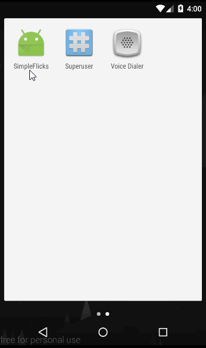

# Project 1 - *Simple Flicks*

**Simple Flicks** shows the latest movies currently playing in theaters. The app utilizes the Movie Database API to display images and basic information about these movies to the user.

Time spent: **20** hours spent in total

## User Stories

The following **required** functionality is completed:

* [x] User can **scroll through current movies** from the Movie Database API
* [x] Layout is optimized with the [ViewHolder](http://guides.codepath.com/android/Using-an-ArrayAdapter-with-ListView#improving-performance-with-the-viewholder-pattern) pattern.
* [x] For each movie displayed, user can see the following details:
  * [x] Title, Poster Image, Overview (Portrait mode)
  * [x] Title, Backdrop Image, Overview (Landscape mode)

The following **optional** features are implemented:

* [ ] User can **pull-to-refresh** popular stream to get the latest movies.
* [ ] Display a nice default [placeholder graphic](http://guides.codepath.com/android/Displaying-Images-with-the-Picasso-Library#configuring-picasso) for each image during loading.
* [ ] Improved the user interface through styling and coloring.

The following **bonus** features are implemented:

* [ ] Allow user to view details of the movie including ratings and popularity within a separate activity or dialog fragment.
* [ ] When viewing a popular movie (i.e. a movie voted for more than 5 stars) the video should show the full backdrop image as the layout.  Uses [Heterogenous ListViews](http://guides.codepath.com/android/Implementing-a-Heterogenous-ListView) or [Heterogenous RecyclerView](http://guides.codepath.com/android/Heterogenous-Layouts-inside-RecyclerView) to show different layouts.
* [ ] Allow video trailers to be played in full-screen using the YouTubePlayerView.
    * [ ] Overlay a play icon for videos that can be played.
    * [ ] More popular movies should start a separate activity that plays the video immediately.
    * [ ] Less popular videos rely on the detail page should show ratings and a YouTube preview.
* [ ] Apply the popular [Butterknife annotation library](http://guides.codepath.com/android/Reducing-View-Boilerplate-with-Butterknife) to reduce boilerplate code.
* [ ] Apply rounded corners for the poster or background images using [Picasso transformations](https://guides.codepath.com/android/Displaying-Images-with-the-Picasso-Library#other-transformations)
* [ ] Replaced android-async-http network client with the popular [OkHttp](http://guides.codepath.com/android/Using-OkHttp) or [Volley](http://guides.codepath.com/android/Networking-with-the-Volley-Library) networking libraries.

The following **additional** features are implemented:

* [ ] List anything else that you can get done to improve the app functionality!

## Video Walkthrough

Here's a walkthrough of implemented user stories with portrait mode:



And landscape mode:


GIF created with [LiceCap](http://www.cockos.com/licecap/).

## Notes

If I add NoActionBar style, I'll meet errors when building the project.

````No resource found that matches the given name: attr 'windowActionBar>'.````

## Open-source libraries used

- [Retrofit](https://square.github.io/retrofit/) - A type-safe HTTP client for Android and Java
- [Glide](https://github.com/bumptech/glide) - An image loading and caching library for Android focused on smooth scrolling

## License

    Copyright 2016 binhle12